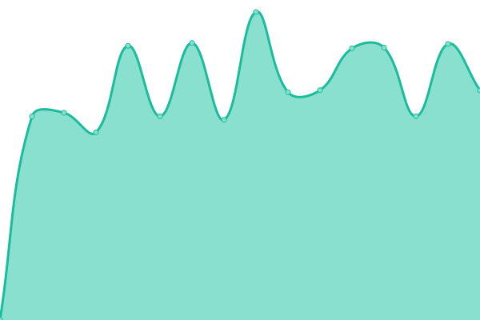
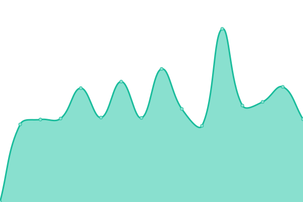
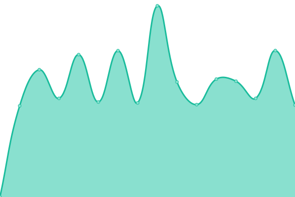
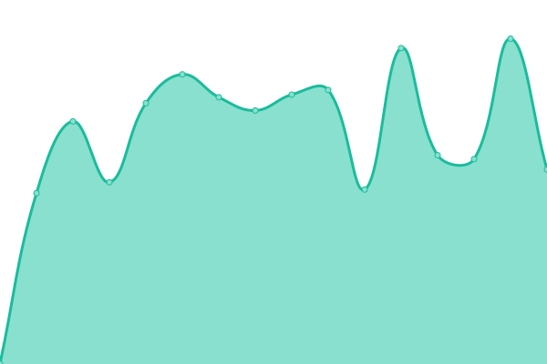
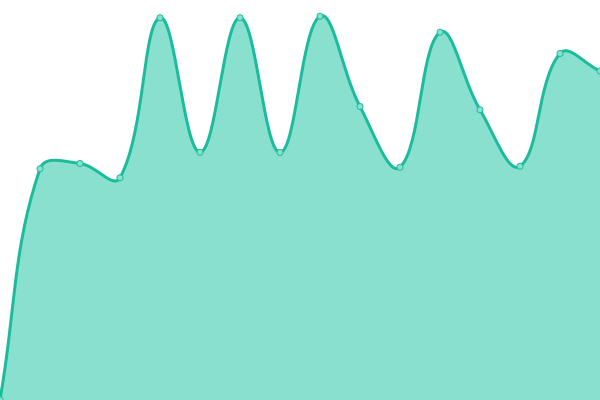
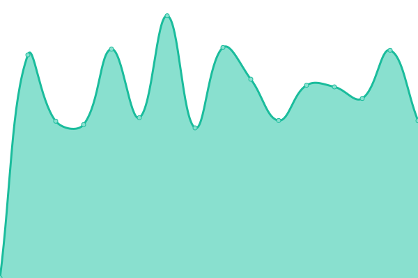
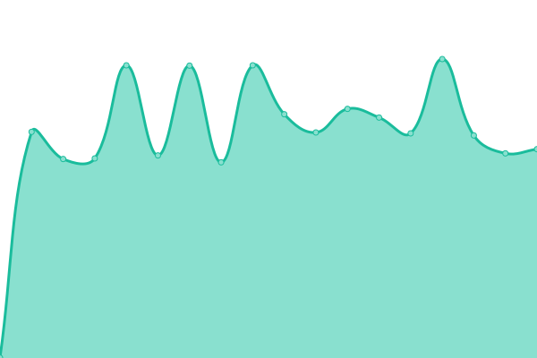

# [📈 Live Status](https://demo.upptime.js.org): <!--live status--> **🟧 Partial outage**

This repository contains the open-source uptime monitor and status page for [undefined](https://demo.upptime.js.org), powered by [Upptime](https://github.com/upptime/upptime).

With [Upptime](https://upptime.js.org), you can get your own unlimited and free uptime monitor and status page, powered entirely by a GitHub repository. We use [Issues](https://github.com/undefined/upptime/issues) as incident reports, [Actions](https://github.com/undefined/upptime/actions) as uptime monitors, and [Pages](https://demo.upptime.js.org) for the status page.

<!--start: status pages-->
<!-- This summary is generated by Upptime (https://github.com/upptime/upptime) -->
<!-- Do not edit this manually, your changes will be overwritten -->
<!-- prettier-ignore -->
| URL | Status | History | Response Time | Uptime |
| --- | ------ | ------- | ------------- | ------ |
|  [SIBUR](https://178.248.232.145) | 🟥 Down | [sibur.yml](https://github.com/callmeurpapa/uptime/commits/HEAD/history/sibur.yml) | 

 0ms
     
 | 

<a href="https://callmeurpapa.github.io/uptime/history/sibur">99.34%</a>
    

|  [TAIF](http://taif.ru) | 🟩 Up | [taif.yml](https://github.com/callmeurpapa/uptime/commits/HEAD/history/taif.yml) | 

 773ms
     
 | 

<a href="https://callmeurpapa.github.io/uptime/history/taif">99.15%</a>
    

|  [B2b](https://b2b.sibur.ru) | 🟩 Up | [b2b.yml](https://github.com/callmeurpapa/uptime/commits/HEAD/history/b2b.yml) | 

 2053ms
     
 | 

<a href="https://callmeurpapa.github.io/uptime/history/b2b">100.00%</a>
    

|  [B2B-rni](https://b2b-rni.sibur.ru) | 🟩 Up | [b2-b-rni.yml](https://github.com/callmeurpapa/uptime/commits/HEAD/history/b2-b-rni.yml) | 

 2420ms
     
 | 

<a href="https://callmeurpapa.github.io/uptime/history/b2-b-rni">100.00%</a>
    

|  [career](https://career.sibur.ru) | 🟩 Up | [career.yml](https://github.com/callmeurpapa/uptime/commits/HEAD/history/career.yml) | 

 2516ms
     
 | 

<a href="https://callmeurpapa.github.io/uptime/history/career">100.00%</a>
    

|  [Nipigas](https://5.23.53.236) | 🟥 Down | [nipigas.yml](https://github.com/callmeurpapa/uptime/commits/HEAD/history/nipigas.yml) | 

 0ms
     
 | 

<a href="https://callmeurpapa.github.io/uptime/history/nipigas">99.96%</a>
    

|  [Amur GCC](https://amur-gcc.ru) | 🟩 Up | [amur-gcc.yml](https://github.com/callmeurpapa/uptime/commits/HEAD/history/amur-gcc.yml) | 

 1761ms
     
 | 

<a href="https://callmeurpapa.github.io/uptime/history/amur-gcc">99.88%</a>
    

|  [YUG](http://sibur-yug.ru) | 🟩 Up | [yug.yml](https://github.com/callmeurpapa/uptime/commits/HEAD/history/yug.yml) | 

 906ms
     
 | 

<a href="https://callmeurpapa.github.io/uptime/history/yug">99.96%</a>
    

|  [Magazine](https://magazine.sibur.ru) | 🟩 Up | [magazine.yml](https://github.com/callmeurpapa/uptime/commits/HEAD/history/magazine.yml) | 

 2109ms
     
 | 

<a href="https://callmeurpapa.github.io/uptime/history/magazine">100.00%</a>
    

|  [Digest](https://digest.sibur.ru) | 🟩 Up | [digest.yml](https://github.com/callmeurpapa/uptime/commits/HEAD/history/digest.yml) | 

 1824ms
     
 | 

<a href="https://callmeurpapa.github.io/uptime/history/digest">100.00%</a>
    

|  [Digital](https://sibur.digital) | 🟩 Up | [digital.yml](https://github.com/callmeurpapa/uptime/commits/HEAD/history/digital.yml) | 

 2683ms
     
 | 

<a href="https://callmeurpapa.github.io/uptime/history/digital">100.00%</a>
    

|  [Eshop](https://eshop.sibur.ru) | 🟩 Up | [eshop.yml](https://github.com/callmeurpapa/uptime/commits/HEAD/history/eshop.yml) | 

 1820ms
     
 | 

<a href="https://callmeurpapa.github.io/uptime/history/eshop">100.00%</a>
    

|  [Social](https://social.sibur.ru) | 🟩 Up | [social.yml](https://github.com/callmeurpapa/uptime/commits/HEAD/history/social.yml) | 

 1285ms
     
 | 

<a href="https://callmeurpapa.github.io/uptime/history/social">100.00%</a>
    

|  [Sharefile](https://sharefile.sibur.ru) | 🟩 Up | [sharefile.yml](https://github.com/callmeurpapa/uptime/commits/HEAD/history/sharefile.yml) | 

 1981ms
     
 | 

<a href="https://callmeurpapa.github.io/uptime/history/sharefile">100.00%</a>
    

|  [Spasibo](https://thanks.sibur.ru) | 🟥 Down | [spasibo.yml](https://github.com/callmeurpapa/uptime/commits/HEAD/history/spasibo.yml) | 

 0ms
     
 | 

<a href="https://callmeurpapa.github.io/uptime/history/spasibo">58.79%</a>
    

<!--end: status pages-->

[**Visit our status website →**](https://demo.upptime.js.org)

## 📄 License

- Powered by: [Upptime](https://github.com/upptime/upptime)
- Code: [MIT](./LICENSE) © [undefined](https://demo.upptime.js.org)
- Data in the `./history` directory: [Open Database License](https://opendatacommons.org/licenses/odbl/1-0/)
